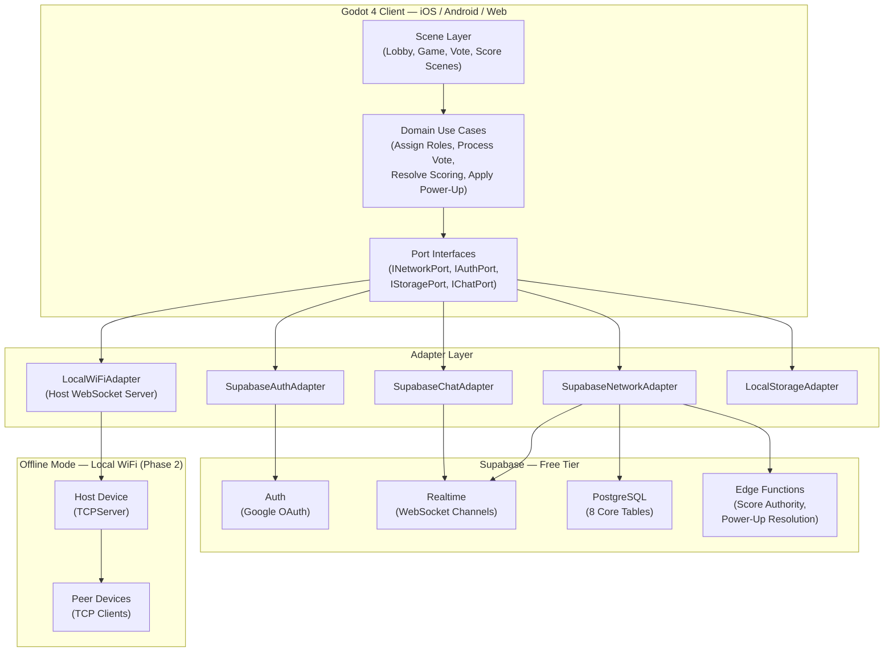

# The Royal Ruse — Technical Design Document

| Field       | Value                                             |
|-------------|---------------------------------------------------|
| Version     | 1.0                                               |
| Date        | April 2026                                        |
| Status      | Approved                                          |
| Engine      | Godot 4.3 (GDScript)                              |
| Backend     | Supabase (Free Tier)                              |
| Platforms   | iOS · Android · Web (HTML5/WASM)                  |
| Developer   | Solo                                              |
| Budget      | Zero (open-source tools only)                     |

---

## Table of Contents

1. [Executive Summary](#1-executive-summary)
2. [Recommended Tech Stack](#2-recommended-tech-stack)
3. [Core Architecture](#3-core-architecture)
4. [High-Level Architecture](#4-high-level-architecture)
5. [Game Design Reference](#5-game-design-reference)
6. [Data Management & Cloud Saves](#6-data-management--cloud-saves)
7. [Asset Pipeline & Performance](#7-asset-pipeline--performance)
8. [Security & Compliance](#8-security--compliance)
9. [Phased Roadmap](#9-phased-roadmap)

---

## 1. Executive Summary

The Royal Ruse is a cross-platform social deduction roguelike inspired by the Indian childhood game *Raja, Rani, Police, Thief*. It targets players aged 25–40 across iOS, Android, and web browsers, delivering real-time multiplayer sessions of 4–10 players with role-based objectives, a blind alliance system, and a tiered power-up economy.

The architecture is built on **Hexagonal (Ports and Adapters)** principles. All game domain logic is completely decoupled from transport, authentication, and persistence. A single codebase serves online play via Supabase Realtime and (Phase 2) offline play via local WiFi WebSocket — without touching any game logic.

**Vertical Slice Goal:** A full 3-round online multiplayer loop (without power-ups) playable across Web, Android, and iOS within 8 weeks. Solo developer. Zero infrastructure cost.

**Year-one target:** 500 monthly active users. The entire stack fits within Supabase and Netlify free tiers at this scale.

---

## 2. Recommended Tech Stack

### 2.1 Decision Summary

| Layer               | Choice                            | Rationale                                                                 |
|---------------------|-----------------------------------|---------------------------------------------------------------------------|
| **Game Engine**     | Godot 4.3 (GDScript)              | Native iOS/Android/Web export, built-in 2.5D AnimationTree, open-source, zero licence cost |
| **Language**        | GDScript (primary)                | Python-like, first-class Godot integration, statically typed in Godot 4, no extra tooling |
| **Backend & Auth**  | Supabase (Free Tier)              | PostgreSQL + Auth + Realtime + Edge Functions under one free-tier umbrella |
| **Real-time**       | Supabase Realtime Channels        | WebSocket-based presence and broadcast; handles game state, chat, countdowns |
| **Web Hosting**     | Netlify (Free Tier)               | Auto-deploy from GitHub, custom headers support (required for SharedArrayBuffer) |
| **Offline (P2)**    | Local WiFi WebSocket              | GodotTCPServer on host device; no internet required for in-person play   |
| **Text Chat**       | Supabase Realtime (built in-house)| Full phase-locking control; no third-party dependency or mobile limitations |
| **Name Generation** | Custom GDScript wordlist          | No API needed; client-side; funny, culturally informed, never offensive  |
| **Mobile Export**   | Godot Export Templates            | Official iOS/Android exporters; iOS requires macOS build machine          |
| **Art Pipeline**    | Aseprite (open-source build)      | 2.5D sprite and skeletal animation; exports sprite sheets into Godot      |
| **Testing**         | GUT (Godot Unit Test)             | Purpose-built for GDScript; integrates with GitHub Actions headless       |
| **CI/CD**           | GitHub Actions + barichello/godot-ci | Pre-built Godot 4 Docker image; free on public repos                  |

### 2.2 Engine Decision: Godot 4 vs React Native vs Phaser

| Criterion                    | Godot 4        | React Native + Expo  | Phaser + Capacitor |
|------------------------------|----------------|----------------------|--------------------|
| 2.5D skeletal animation      | ✅ Built-in     | ❌ Requires bolt-ons | ⚠️ Limited          |
| Shadow Fight 2-style visuals | ✅ Purpose-built| ❌ Wrong tool        | ⚠️ Rough            |
| iOS + Android + Web export   | ✅ Native       | ✅ Expo handles it   | ⚠️ Capacitor fragile|
| Game loop / ECS              | ✅ Native       | ❌ Hand-rolled       | ⚠️ Manual           |
| Real-time multiplayer        | ✅ Native WS    | ✅ Via Supabase      | ✅                  |
| Solo 2-month deadline        | ⚠️ GDScript ramp| ✅ TS familiarity    | ⚠️ Mobile wrapping  |
| Zero budget                  | ✅              | ✅                   | ✅                  |

**Decision: Godot 4.** The Shadow Fight 2-style 2.5D requirement and game loop necessity rule out React Native. The tradeoff accepted is 1–2 weeks of GDScript onboarding.

### 2.3 Backend Decision: Supabase vs Alternatives

| Criterion                | Supabase       | Firebase       | PocketBase     | Appwrite       |
|--------------------------|----------------|----------------|----------------|----------------|
| Free tier MAU            | ✅ 50,000       | ✅ Limited      | ✅ Self-host    | ✅ Self-host    |
| Database type            | ✅ PostgreSQL   | ❌ Firestore   | ✅ SQLite       | ✅ MariaDB      |
| Realtime                 | ✅ Native WS    | ✅ Native       | ⚠️ SSE only    | ✅ WS           |
| Server-side logic        | ✅ Edge Fns     | ✅ Cloud Fns    | ⚠️ JS hooks    | ✅ Functions    |
| Google Auth built-in     | ✅              | ✅              | ⚠️ Manual      | ✅              |
| Zero server management   | ✅ Fully managed| ✅ Managed     | ❌ Needs VPS   | ❌ Needs VPS   |
| Open source              | ✅ Apache 2.0   | ❌ Proprietary  | ✅ MIT         | ✅ BSD          |

**Decision: Supabase.** Relational schema, managed service, and free tier all align. Firebase ruled out by document-store model complexity for relational game data.

---

## 3. Core Architecture

### 3.1 Hexagonal Architecture (Ports and Adapters)

The codebase is divided into three explicit layers. Code in inner layers must never import from outer layers.

```
┌──────────────────────────────────────────────────────────┐
│  Scene Layer   (Godot scenes, UI Control nodes)          │  → calls Use Cases only
├──────────────────────────────────────────────────────────┤
│  Domain Layer  (Entities, Use Cases, Value Objects,      │  → no external dependencies
│                Domain Services)                          │
├──────────────────────────────────────────────────────────┤
│  Adapter Layer (Supabase, WiFi, LocalStorage, NameGen)   │  → implements Port interfaces
└──────────────────────────────────────────────────────────┘
         ↕ Communication via Port interfaces only ↕
```

**Rule:** The Domain Layer has zero knowledge of Supabase, HTTP, WebSockets, or Godot scenes. It calls only Port interfaces. Concrete Adapters are injected at startup via the `ServiceLocator` autoload.

### 3.2 Domain Layer Contents

**Entities** — Core game concepts with identity and behaviour:
`Player`, `GameSession`, `Round`, `Role`, `PowerUp`, `Alliance`, `Score`

**Value Objects** — Immutable typed wrappers:
`Result`, `SessionCode`, `RoleAssignment`, `PredictionSeal`, `AccompliceToken`

**Domain Services** — Pure stateless logic with no external dependencies:
`RoleAssigner`, `ScoringEngine`, `WantedBrandTracker`, `AllianceEvaluator`, `ObjectiveEvaluator`

**Use Cases** — Application logic orchestrating entities through ports:
`CreateSession`, `JoinSession`, `AssignRoles`, `SubmitVote`, `SubmitPrediction`, `ResolveScoring`, `EvaluateAlliances`, `ChatService`

**Domain Events** (broadcast via GameBus):
`session_status_changed`, `roles_assigned`, `discussion_opened`, `vote_resolved`, `scoring_resolved`, `alliance_evaluated`, `player_connection_changed`, `round_ended`, `game_ended`

### 3.3 Port Interfaces

| Port                  | Purpose                                              | Online Adapter           | Offline Adapter (P2)      |
|-----------------------|------------------------------------------------------|--------------------------|---------------------------|
| `INetworkPort`        | Send/receive game state events                       | `SupabaseNetworkAdapter` | `LocalWiFiNetworkAdapter` |
| `IAuthPort`           | Sign in as guest or Google user                      | `SupabaseAuthAdapter`    | `GuestAuthAdapter`        |
| `IStoragePort`        | Persist and retrieve scores and session data         | `SupabaseStorageAdapter` | `GodotLocalStorageAdapter`|
| `IChatPort`           | Send/receive text messages scoped to a session       | `SupabaseChatAdapter`    | `LocalWiFiChatAdapter`    |
| `INameGeneratorPort`  | Generate session codes and player display names      | `WordlistNameGenerator`  | `WordlistNameGenerator`   |

### 3.4 Autoloads (Global Singletons)

| Autoload           | Role                                                               |
|--------------------|--------------------------------------------------------------------|
| `ServiceLocator`   | Wires concrete adapters to port interfaces at startup              |
| `GameBus`          | Global signal hub — scenes subscribe without tight coupling        |
| `SceneManager`     | Single source of all scene transitions; no hardcoded paths         |
| `Config`           | Reads environment variables from `res://.env` at startup           |

### 3.5 Game State Machine

All state transitions are server-authoritative. Clients receive state via Realtime broadcast and react via `GameBus.session_status_changed`.

```
LOBBY → ROUND_START → ROLE_REVEAL → DISCUSSION → VOTE → SCORING → ROUND_END
                                                                        │
                      ← (if rounds remain, loop to ROUND_START) ────────┘
                                                                        │
                                                                   GAME_END
```

| State        | Duration          | Who Controls  | Key Events                              |
|--------------|-------------------|---------------|-----------------------------------------|
| LOBBY        | Up to 60s         | Admin / timer | Players join; admin starts or timeout   |
| ROUND_START  | Instant           | Server        | Edge Fn assigns roles + alliances       |
| ROLE_REVEAL  | Until shop closes | Players       | Power-up shop open; Thief nominates     |
| DISCUSSION   | Admin-configured  | Timer         | Chat open; Queen/General/Spy predict    |
| VOTE         | 10s               | Timer         | Chat locked; Police votes               |
| SCORING      | Instant           | Server        | Edge Fn resolves all scores             |
| ROUND_END    | 10s display       | Timer         | Score screen shown; next round or end   |
| GAME_END     | Persistent        | —             | Final standings; scores persisted       |

### 3.6 Cross-Platform Input Handling

Godot 4's `InputEvent` system abstracts touch and mouse natively via the Input Map. No platform-specific code exists in scene scripts.

- **Touch (mobile):** `InputEventScreenTouch` and `InputEventScreenDrag` — remapped to action names
- **Mouse (web/desktop):** `InputEventMouseButton` — same action names
- **Minimum tap target:** 44×44 logical pixels on all interactive elements

---

## 4. High-Level Architecture

### 4.1 Component Interaction Map (Mermaid.js)



### 4.2 Narrative

**Online flow:** Scene Layer calls Use Cases. Use Cases call Port interfaces. `ServiceLocator` has wired the Supabase adapters. Events broadcast via Supabase Realtime channels. Scoring runs exclusively in Edge Functions — the client sends intents and receives resolved state.

**Offline flow (Phase 2):** `ServiceLocator._wire_offline_adapters()` is called at session creation. `LocalWiFiNetworkAdapter` spins up a `GodotTCPServer` on the host. Peers discover the host via subnet broadcast. Same domain event interface — only the adapters swap.

**Chat:** A separate Realtime channel per session, phase-locked server-side. Messages rejected during VOTE and SCORING phases.

---

## 5. Game Design Reference

### 5.1 Role Roster

| Role            | Points | Unlocks At  | Round Objective                                               | Bonus       |
|-----------------|--------|-------------|---------------------------------------------------------------|-------------|
| King            | 1,000  | 4 players   | Survive without being accused during Police deliberation      | +100        |
| Queen           | 800    | 4 players   | Secretly predict which player Police will accuse              | +80 if correct |
| Police          | 100    | 4 players   | Correctly identify and accuse the Thief within 10s            | Core mechanic |
| Thief           | 0      | 4 players   | Escape. Secretly nominate one Accomplice before discussion    | Steal 100 + 25 on escape |
| Prime Minister  | 700    | 5 players   | Police accuses King or Queen                                  | +150        |
| General         | 600    | 6 players   | Binary prediction before discussion: caught or escaped        | +100 if correct |
| Spy             | 500    | 7 players   | Double prediction: who Police accuses AND outcome             | +150 both correct / +75 one correct |
| Merchant        | 400    | 8 players   | Any false accusation fine paid this round                     | +75         |
| Jester          | 300    | 9 players   | Get accused by Police without being the Thief                 | +200        |
| Priest          | 200    | 10 players  | Police correctly catches the Thief                            | +100        |

Roles shuffle randomly each round. A player's role from round N has no bearing on round N+1.

### 5.2 Thief Mechanic — Combined Bluff Tax + Accomplice

Before discussion, the Thief secretly nominates one player as Accomplice (server-stored, never visible until scoring).

**Police guesses wrong (or timeout):**
- Thief steals 100 from Police
- Thief gains 25 from the falsely accused player
- Accomplice earns +50 silently
- Falsely accused player loses 25

**Police guesses correctly:**
- Thief earns 0
- Police keeps 100
- Accomplice loses 30

Points can go negative. No floor.

**Wanted Brand (cross-round player status):** If a player escapes as Thief, a Wanted Brand is attached to that player (not the role). Brand persists until that player is caught as Thief. When branded: Police earns +50 for catching; branded Thief claims the +50 if they escape again.

### 5.3 Alliance System — Blind Complementary

- Assigned server-side at round start (~60% of rounds have an active alliance)
- Neither player is informed — both discover their alliance at the score reveal
- If both players' outcomes are complementary, each player's objective bonus is **doubled**
- If only one completes their objective, no multiplier

| Alliance Pairing        | Complementary Condition                                              |
|-------------------------|----------------------------------------------------------------------|
| Thief + Jester          | Thief escapes AND Jester is accused (as non-Thief)                  |
| Thief + Spy             | Thief escapes AND Spy correctly predicts both outcomes              |
| King + Priest           | King survives unaccused AND Police catches Thief                    |
| Queen + Prime Minister  | Queen prediction correct AND PM royalty-downfall triggered          |
| General + Merchant      | General prediction correct AND false accusation fine paid           |
| Spy + General           | Both Spy and General predict correctly in the same round            |

### 5.4 Power-Up System

Role-locked. Presented as 3 random options at ROLE_REVEAL phase. Single-use per purchase. Multiple purchases allowed per round if points permit. All effects resolved server-side.

| Tier   | Cost     | Accessibility                                              |
|--------|----------|------------------------------------------------------------|
| Tier I | 75 pts   | Police (100 pts base) can afford after round 1 win         |
| Tier II| 350 pts  | Comfortable for King/Queen/PM after 1–2 strong rounds      |
| Tier III| 850 pts | Requires strategic multi-round saving across all roles     |

**Effect categories:** Score Manipulation · Information · Accusation Interference · Alliance Interference · Objective Sabotage

Each role has 9 power-ups (3 per tier). Full catalogue in [PRD-1e](../prd/PRD-1e-alliance-objectives-chat.md).

---

## 6. Data Management & Cloud Saves

### 6.1 Database Schema

All tables use UUID primary keys generated server-side. RLS enabled on all tables. Score writes are exclusively server-initiated via Edge Functions.

| Table                | Purpose                                                      |
|----------------------|--------------------------------------------------------------|
| `users`              | Persistent player identity. Guests have `null google_id`.   |
| `sessions`           | Game session record. `status` is the server-authoritative state machine. |
| `session_players`    | Junction: who is in which session. `is_active` false on disconnect. |
| `rounds`             | One row per round. Outcome written by Edge Function only.    |
| `round_roles`        | One row per player per round. Final points set by Edge Function. |
| `round_predictions`  | Sealed predictions (Queen, General, Spy). RLS blocks reads until round complete. |
| `alliances`          | Blind alliance record. Never exposed to clients until score reveal. |
| `powerup_purchases`  | Every purchase logged. Affordability validated server-side.  |
| `scores`             | Running cumulative score per player per session. Upserted via RPC. |

### 6.2 Anti-Cheat Posture

The client is untrusted. All scoring lives in Edge Functions.

- **Vote submission:** Idempotent, time-bounded (10s window), one per Police per round
- **Power-up affordability:** Validated against cumulative score before purchase recorded
- **Alliance assignments:** Generated and stored server-side; never in client payloads until scoring
- **Role assignments:** Sent to individual players via private channels; not broadcast
- **Accomplice nomination:** Stored encrypted server-side until scoring reveal
- **Scoring:** Client sends intents only. Server sends resolved state.

### 6.3 Local Storage & Offline Sync

Offline sessions stored in Godot's `ConfigFile` (`user://offline_rounds.cfg`). On reconnection, a background sync job writes staged data to Supabase. Conflict resolution: server timestamp wins. Guest player data is never persisted — session-scoped only.

### 6.4 Row-Level Security Overview

| Table              | Read Policy                                    | Write Policy               |
|--------------------|------------------------------------------------|----------------------------|
| `users`            | Own row only                                   | Via Edge Function           |
| `sessions`         | Participants of that session only              | Via Edge Function           |
| `round_roles`      | Own role + all roles post-round completion     | Via Edge Function           |
| `alliances`        | Post-round completion only                     | Via Edge Function           |
| `round_predictions`| Post-round completion only                     | Own row INSERT only         |
| `scores`           | All participants (leaderboard)                 | Via Edge Function (RPC)     |
| `powerup_purchases`| Own purchases only                             | Via Edge Function           |

---

## 7. Asset Pipeline & Performance

### 7.1 Targets

| Metric            | Target                                                      |
|-------------------|-------------------------------------------------------------|
| Frame rate        | 60fps on mid-range Android (2019+) and iOS (iPhone XR+)    |
| Draw calls        | < 100 per frame during gameplay                             |
| Texture memory    | < 256 MB total                                              |
| Web initial load  | < 5s on 4G                                                  |

### 7.2 Art Style

2.5D Indian royalty illustrated style — reference: Shadow Fight 2 (silhouette-dominant characters with ornate detail, layered parallax backgrounds). All art in **Aseprite** (open-source build). Exported as PNG sprite sheets. Imported via Godot's `SpriteFrames` and `AnimatedSprite2D`.

- **Character rigs:** 10 role avatars × 4 animation states (Idle, React, Accused, Celebrate) via Godot's `Skeleton2D`
- **Backgrounds:** 3–4 layered parallax sprites per scene
- **UI:** Vector-style via Godot themes. No raster UI. Scales cleanly.
- **Role cards:** Godot `Control` nodes — text and avatar composited at runtime. No baked textures.

### 7.3 Texture Compression

| Platform         | Format                          | Notes                              |
|------------------|---------------------------------|------------------------------------|
| iOS / Android    | ASTC                            | Godot export settings; mipmaps on  |
| Web (HTML5)      | S3TC/BPTC + Basis Universal     | Godot HTML5 export handles auto    |
| Atlas            | 2048×2048 per role set          | All frames packed; 1 bind per set  |
| Max texture size | 512×512 chars, 1024×512 bg      |                                    |

### 7.4 Audio Strategy

- **Ambient:** 2–3 looping tracks (royal court, tense discussion, resolution). Source: Freesound / OpenGameArt (open-licence)
- **SFX:** Card flip, accusation, escape, alliance reveal, power-up. All < 2s. OGG Vorbis.
- **Adaptive:** `AudioServer` bus switching by phase. Discussion ducks ambient 6dB. Vote switches to percussive loop.
- **Web:** First audio plays on first user interaction (browser autoplay policy).

### 7.5 Load Optimisation

- Godot WASM binary ~8MB gzipped. Pre-cached via service worker.
- Role avatar atlases lazy-loaded on first session join, not at app launch.
- Preload per round during LOBBY phase before gameplay begins.

---

## 8. Security & Compliance

### 8.1 Authentication

- Google Sign-In via Supabase Auth. JWT short-lived (1 hour), refreshed silently.
- Guest sessions use device UUID (`OS.get_unique_id()`). No PII collected. Auto-purged after 30 days inactivity.
- Session codes expire 30 minutes after session end.
- If active session exists and player signs out, demoted to guest for that session.

### 8.2 Rate Limiting

| Action               | Limit                          | Enforcement              |
|----------------------|--------------------------------|--------------------------|
| Session creation     | 3 per user per hour            | Edge Function + KV check |
| Vote submission      | 1 per Police per round         | 409 Conflict on duplicate|
| Chat messages        | 20 per player per discussion   | Client enforced + server |
| Power-up purchase    | Validated against score balance| Server-side before INSERT|

### 8.3 GDPR Compliance

- **Data minimisation:** `display_name` and `google_id` (email hash) only. No raw email stored.
- **Right to deletion:** Edge Function soft-deletes `users` row; anonymises `round_roles` and `scores`.
- **Guest data:** No PII. Purged server-side after 30 days.
- **Data residency:** Supabase project in EU (Frankfurt) — aligns with UK GDPR.
- **Analytics:** None in Phase 1. No advertising SDK. No data sold.

### 8.4 Encryption

- **In transit:** TLS 1.3 on all Supabase communication. Local WiFi WebSocket unencrypted (LAN-only, offline, no PII in transit).
- **At rest:** Supabase PostgreSQL AES-256 encrypted by default.
- **Accomplice nomination:** Stored as hashed player_id until scoring. Unreadable by clients via RLS.

### 8.5 Edge Function Security

- All Edge Functions use `SUPABASE_SERVICE_ROLE_KEY` (admin key) — never the anon key
- Idempotency checks on all state-mutating endpoints
- All inputs validated before database operations
- No client-supplied values trusted for score calculation

---

## 9. Phased Roadmap

### Phase 1 — Vertical Slice (Weeks 1–8)

| Sub-Phase | Duration   | Deliverable                                                         |
|-----------|------------|---------------------------------------------------------------------|
| 1a        | Weeks 1–2  | Godot scaffold, hexagonal skeleton, GUT, GitHub Actions CI          |
| 1b        | Weeks 1–2  | Supabase schema, Google Auth, RLS, Edge Function scaffold           |
| 1c        | Weeks 3–4  | Session create/join, lobby timer, role assignment engine            |
| 1d        | Weeks 5–6  | Police vote countdown, Thief/Accomplice scoring, Wanted Brand       |
| 1e        | Weeks 6–7  | Alliance engine, objective tracking, text chat                      |
| 1f        | Weeks 7–8  | Full integration, Web/Android/iOS deployment                        |

**Vertical Slice Definition of Done:**
- 4–10 players, online session, 3 rounds, all 10 roles, server-side scoring, alliances, objectives, text chat, deployed to Netlify + Android APK + TestFlight. All GUT domain tests passing in CI.

### Phase 2 — Full Game (Weeks 9–18)

Power-up system (90 power-ups), 2.5D art and skeletal animations, audio (ambient + SFX + adaptive), offline Local WiFi mode, extended role disconnect handling, Wanted Brand persistence, admin kick UI.

### Phase 3 — Production Launch (Weeks 19–24)

Platform polish, App Store + Play Store submissions, security hardening audit, GDPR deletion UI, beta programme (up to 100 users), Supabase upgrade path documentation for > 500 MAU.

### Scale Trigger Points

| Threshold | Action Required                          | Cost            |
|-----------|------------------------------------------|-----------------|
| 2,500 MAU | Supabase Pro (Realtime message limit)    | $25/month       |
| 12,500 web loads/month | Netlify Pro (bandwidth)     | $19/month       |
| Play Store launch | Google Developer account          | $25 one-time    |
| App Store launch  | Apple Developer Program           | $99/year        |

---

*End of Technical Design Document — The Royal Ruse v1.0*

> **Related Documents:**
> - [PRD-000 — Phase 1 Master PRD](../prd/PRD-000-main.md)
> - [PRD-1a — Godot Scaffold & CI](../prd/PRD-1a-godot-scaffold.md)
> - [PRD-1b — Supabase Setup](../prd/PRD-1b-supabase-setup.md)
> - [PRD-1c — Session, Lobby & Roles](../prd/PRD-1c-session-lobby-roles.md)
> - [PRD-1d — Vote & Scoring](../prd/PRD-1d-vote-scoring.md)
> - [PRD-1e — Alliance, Objectives & Chat](../prd/PRD-1e-alliance-objectives-chat.md)
> - [PRD-1f — Vertical Slice & Deployment](../prd/PRD-1f-vertical-slice-deployment.md)
